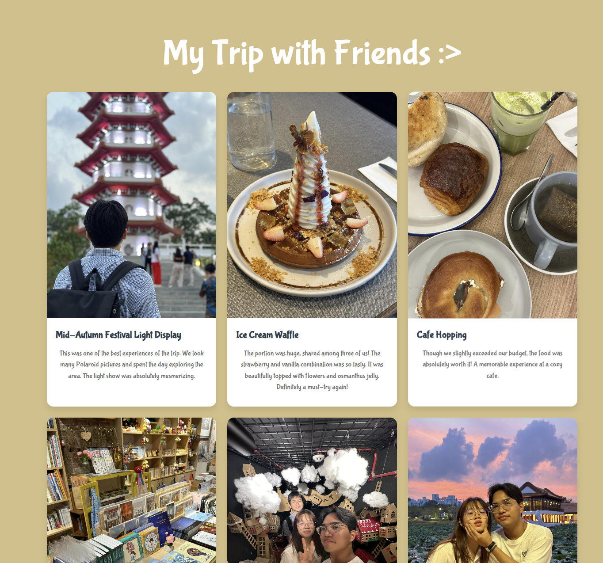

# My Trip with Friends

This is a static web page showcasing the wonderful moments I spent with my friends during our recent trip. The site features a gallery of photos along with reflections on each experience.

## Features
- Responsive design that adapts to different screen sizes.
- A visually appealing layout using CSS Grid for the photo gallery.
- Hover effects to enhance user interaction.

## Getting Started
To view the web page, open `hang_out.html` in a web browser. All photo assets are located in the `photos` directory.

## Screenshots

## Acknowledgments
- Inspiration from personal experiences and interactions with friends.
- Special thanks to my friends for making this trip memorable!

